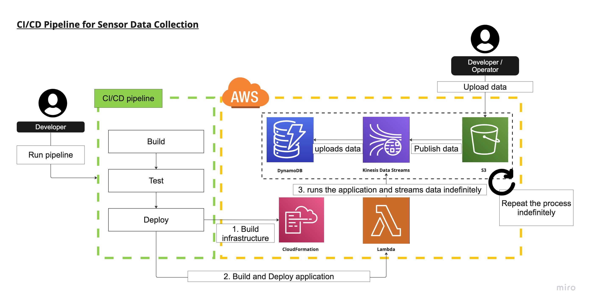

# CI/CD Pipeline for Sensor Data Collection



This README provides an overview of the CI/CD pipeline created to collect sensor data in real-time using AWS managed services.

Challenge Statement
This challenge involves creating a real-time ingestion pipeline for sensor data collection using AWS managed services. The following tasks need to be accomplished:

Data: Utilize the Recommended-Fishing-Rivers-And-Streams dataset available here.

Architecture: Design a real-time ingestion pipeline using AWS managed services and create an architecture diagram to illustrate your design.

## The development environment used:
OS: MacOS (version 13.4.1 on the development machine)<br>
Python: 3.9.0 or higher<br>
AWS CLI: Version 2.10 or higher<br>
SAM CLI: Version 1.82.0 or higher<br>
Docker: Version 20 or higher<br>
Homebrew: Version 4.1.8<br>

## Operation
### Use chmod 755 <filename> to grant permissions to the all scripts.
```sh
# Make sure your at root directory
chmod 755 ./scripts/<file name>.sh
```

### Deploy application and pipeline
```sh
# deploy.sh will build infrastructure, build and deploy application
# environment name = [dev, e2e, prod]
./scripts/deploy.sh <environment name> # ex. ./scripts/deploy.sh e2e
```

## Deliverables
### Architecture
The architecture diagram can be found in the `diagram/` directory, named `diagram.jpeg`

### Implementation
The application implementation code is located in the `lambda/` directory. For this exercise, AWS SAM was used, and the production environment code is in `lambda/hello_world/`.

### Testing
**Unit tests**: 
Unit tests code is in the `lambda/tests/unit/` directory, named `test_handler.py`.

**End to end tests code**:
End to end tests code is in the `lambda/tests/e2e` directory, named `e2e.py`. Tests can be executed using `scripts/e2e.sh`.

### Deployment
<u>**a. Define the infrastructure**</u>

CloudFormation templates for **S3**, **Kinesis Data Streams**, and **DynamoDB** are in the `cfn/ directory` as `s3.yml`, `kds.yml`, and `dynamodb.yml` respectively.

The **Lambda** function is in the `lambda/` directory as `template.yml`.

<u>**b. Provide bash scripts**</u>

`build.sh`, `unit_test.sh`, `deploy.sh`, and `stream.sh` scripts are in the `scripts/` directory at the root of the submission. Unit tests can be executed using `scripts/unit_tests.sh`.

## Time Tracking
**Total hours spent: Approximately <u>20 hours</u>.**

0:30: Planning and task list creation<br>
1:00: Creating Kinesis Data Streams and DynamoDB (IaC)<br>
1:30: Creating Lambda, initial setup (empty)<br>
1:30: Implementing Lambda, data download from S3 and publish to Kinesis<br>
2:30: Implementing Lambda, County field aggregation<br>
2:00: Unit testing<br>
1:30: End-to-end testing
2:30: Scripting (build, deploy, stream, etc.)<br>
4:00: E2E testing and other adjustments<br>
3:30: Diagram and README creation<br>
